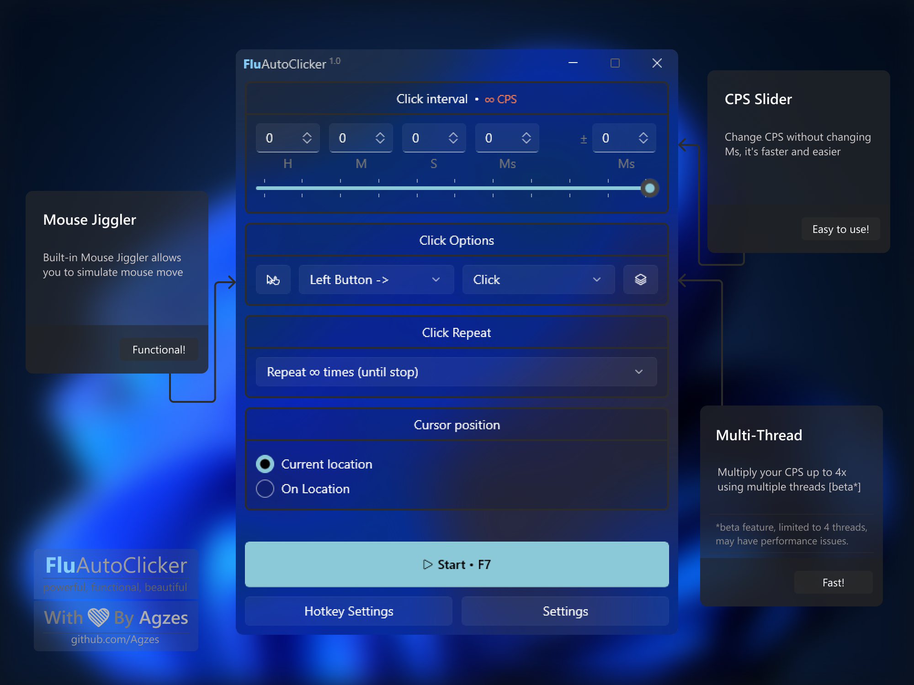

<kbd></kbd> <kbd>🚀 𝗣𝗼𝘄𝗲𝗿𝗳𝘂𝗹</kbd> <kbd>🪶 𝗘𝗮𝘀𝘆 𝗧𝗼 𝗨𝘀𝗲</kbd> <kbd>🟣 𝗖# / 𝗪𝗶𝗻𝗨𝗜 𝟯 🔵</kbd> <kbd>📂 𝗢𝗽𝗲𝗻-𝗦𝗼𝘂𝗿𝗰𝗲</kbd> <kbd></kbd> 

<h1 align="center">&nbsp;&nbsp;&nbsp;&nbsp;&nbsp;&nbsp; $\Huge{\textsf{𝗙𝗹𝘂𝗔𝘂𝘁𝗼𝗖𝗹𝗶𝗰𝗸𝗲𝗿}}$ <kbd>v.1.0</kbd> 
 <kbd>" \ Fluent Auto-Clicker / "</kbd></h1>

<h2 align="center">  </h2>

<kbd align="center">
/𝗟𝗜𝗖𝗘𝗡𝗦𝗘//𝗟𝗜𝗖𝗘𝗡𝗦𝗘//𝗟𝗜𝗖𝗘𝗡𝗦𝗘//𝗟𝗜𝗖𝗘𝗡𝗦𝗘//𝗟𝗜𝗖𝗘𝗡𝗦𝗘//𝗟𝗜𝗖𝗘𝗡𝗦𝗘//𝗟𝗜𝗖𝗘𝗡𝗦𝗘//𝗟𝗜𝗖𝗘𝗡𝗦𝗘//𝗟𝗜𝗖𝗘𝗡𝗦𝗘/<h4> </h4>
<h4>

🛡️ GNU GPLv3: https://github.com/Agzes/FluAutoClicker/blob/main/LICENSE 
</h4><h3></h3>
/𝗟𝗜𝗖𝗘𝗡𝗦𝗘//𝗟𝗜𝗖𝗘𝗡𝗦𝗘//𝗟𝗜𝗖𝗘𝗡𝗦𝗘//𝗟𝗜𝗖𝗘𝗡𝗦𝗘//𝗟𝗜𝗖𝗘𝗡𝗦𝗘//𝗟𝗜𝗖𝗘𝗡𝗦𝗘//𝗟𝗜𝗖𝗘𝗡𝗦𝗘//𝗟𝗜𝗖𝗘𝗡𝗦𝗘//𝗟𝗜𝗖𝗘𝗡𝗦𝗘/</kbd>
  

<kbd align="Center">
/𝗕𝗨𝗜𝗟𝗗//𝗕𝗨𝗜𝗟𝗗//𝗕𝗨𝗜𝗟𝗗//𝗕𝗨𝗜𝗟𝗗//𝗕𝗨𝗜𝗟𝗗//𝗕𝗨𝗜𝗟𝗗//𝗕𝗨𝗜𝗟𝗗//𝗕𝗨𝗜𝗟𝗗//𝗕𝗨𝗜𝗟𝗗/<h4> </h4>
<h4>

🛠️: https://github.com/Agzes/FluAutoClicker/blob/main/BUILD.md

</h4><h3></h3>
/𝗕𝗨𝗜𝗟𝗗//𝗕𝗨𝗜𝗟𝗗//𝗕𝗨𝗜𝗟𝗗//𝗕𝗨𝗜𝗟𝗗//𝗕𝗨𝗜𝗟𝗗//𝗕𝗨𝗜𝗟𝗗//𝗕𝗨𝗜𝗟𝗗//𝗕𝗨𝗜𝗟𝗗//𝗕𝗨𝗜𝗟𝗗/</kbd>

<h2 align="center">  </h2>

<h5 align="center">   
<kbd>visit counter since 15.05.2025 </kbd> </h5>

 <kbd>With</kbd> <kbd>❤️</kbd> <kbd>by</kbd> <kbd>Agzes</kbd> 

